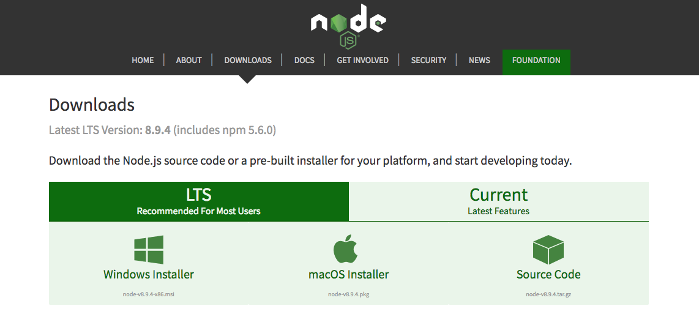
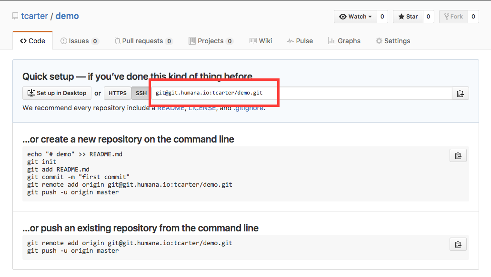

# ProtoKit

A starting point for creating a static HTML/CSS/JS site

> ProtoKit requires Node.js. Before starting with we recommend you [download the latest Node.js LTS for your system](https://nodejs.org/en/download/)



## Getting started

1. Clone this repository

```shell
$ git clone http://git.humana.com/tcarter/protokit
```

2. Navigate to folder

```shell
$ cd protokit
```

3. Install dependencies

```shell
$ npm install
```

4. Setup ProtoKit for your project

```shell
$ npm run setup
```

5. Run your project

```shell
$ npm start
```

## Adding your project to GitHub

Open a terminal window in your project's directory and do the following:

1. Create a local git repository

```shell
$ git init
```

2. Create GitHub repository in your GitHub account and copy remote link



3. Add GitHub remote repository to local repository

```shell
$ git remote add origin <YOUR REMOTE URL>
```

4. Commit changes

```shell
$ git add .
$ git commit -m '<COMMIT MESSAGE>'
```

5. Push changes to GitHub

```shell
$ git push origin head
```
